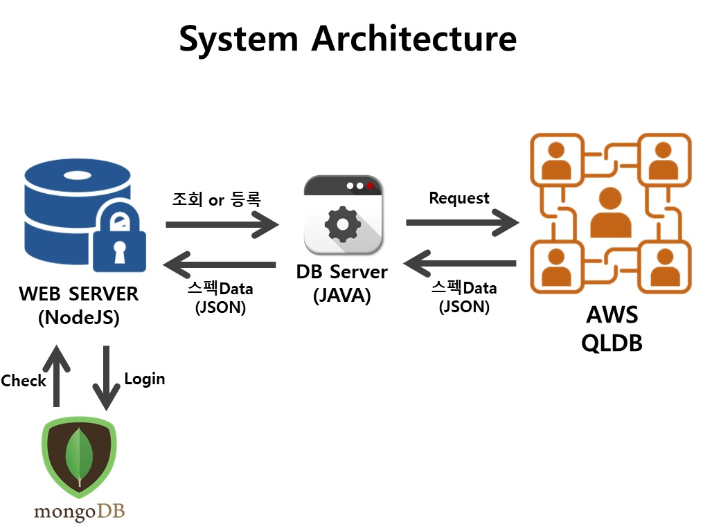
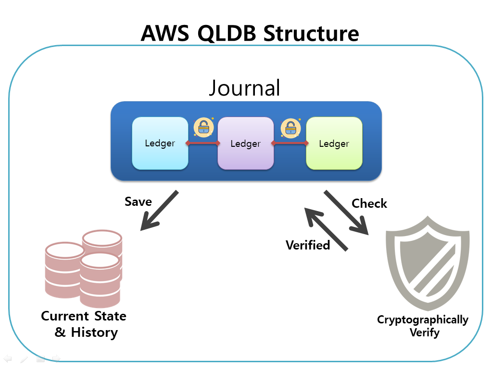

# 대학생과 기업을 위한 투명한 스펙 인증 관리 시스템 	CCMS
## A candid certification management system for university students and enterprise
## 1. 주제에 관하여
### 1-1. 주제 선정 배경
최근 공인들의 공문서 위조와 학력 위조 등의 문제가 사회적으로 대두되고 있다. 소위 스펙이라고 말하는 개인정보들에 대한 인증이 이루어지지 않기 때문이다. 따라서 우리는 공모전이나 대회 등에 대한 수상내역을 인증하고 블록체인을 통해 관리함으로써 스펙 관리의 편의성과 공정성을 제공하고자 한다.
### 1-2. 프로그램 소개
우선 공모전이나 대회의 주최측에서 개최하는 대회에 대한 정보를 입력한다. 대회가 종료되고 수상자 선정이 끝나면 주최측에서는 수상정보를 등록하고 시상인증자의 전자서명을 이용하여 수상에 대한 정보를 인증하게 되고, 블록체인을 이용하여 무결성을 보장한다.
 사용자는 자신의 수상에 대한 정보를 조회할 수 있고, 보안키를 통해 기업이 자신의 정보를 조회하도록 허가해줄 수 있다.
## 2. 사용 언어 및 환경, Tools
+ BlockChain 구성 : Amazon QLDB
+ 중계 DB 서버 : JAVA
+ 웹 Front End : HTML
+ 웹 BackEnd : NodeJS
## 3. 시나리오
+ 주최측 대회 등록 => 정해진 양식 (이 양식이 처방전과 같음 ) 
+ 학생들이 공모전 신청
+ 수상했을 경우 -> 대회주체측에서 수상내역 기록(대상 or 금상 or 은상) -> 시상을 하는 사람( 총장상일경우 총장) 이 인증 -> 수상내역에 포함
+ 수상 못했을 경우 -> ‘참여’ 기록
+ 기업의 취업공고에 학생이 지원할 경우 학생은 자신의 기록을 열람 할 수 있는 권한을 준다.

## 4. 구성도

                                             웹서버와 블록체인 서버간의 interraction
**<전체 System FLOW>**
Web Server <-> Mongo DB : Node JS 기반으로 구성된 Web Server에서 이용자가 Login 기능 호출시 Mongo DB에 있는 회원정보로 비교 검색해 로그인함
Web Server –> DB Server : Web Server가 조회 or 등록 기능을 수행시 QLDB와의 매개체인 DB Server에 데이터가 도착함
DB Server –> AWS QLDB : DB Server에서 AWS QLDB에 Data를 저장 or 조회 요청한다.
AWS QLDB -> DB Server : 조회된 Data또는 등록 성공여부를 DB Server에 JSON 형식으로 전달한다.
DB Server -> Web Server : 받은 Data를 Web Server에 전달한다.
Web Server : HTML기반의 Front-End에 해당 Data를 출력한다.

                                             블록체인 내부 환경 구성도
**<AWS QLDB 내부 구조>**
Journal은 연결되어있는 Ledger(분산원장)들의 전체를 뜻한다.
연결되어있는 Ledger블록들의 현재상태 및 변경 History를 저장한다.
이는 암호학적으로 증명되어진다.
